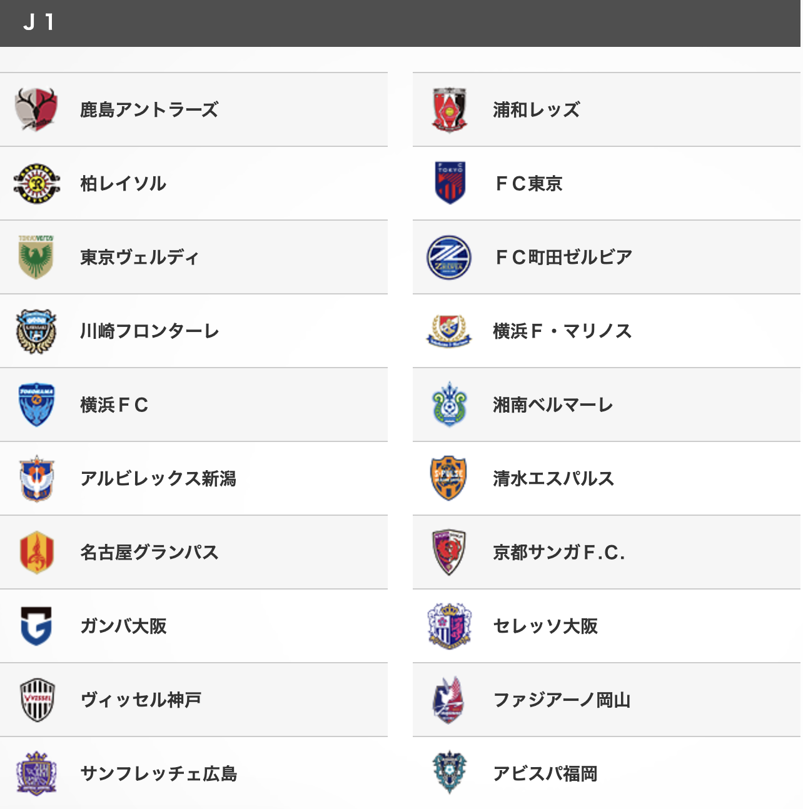
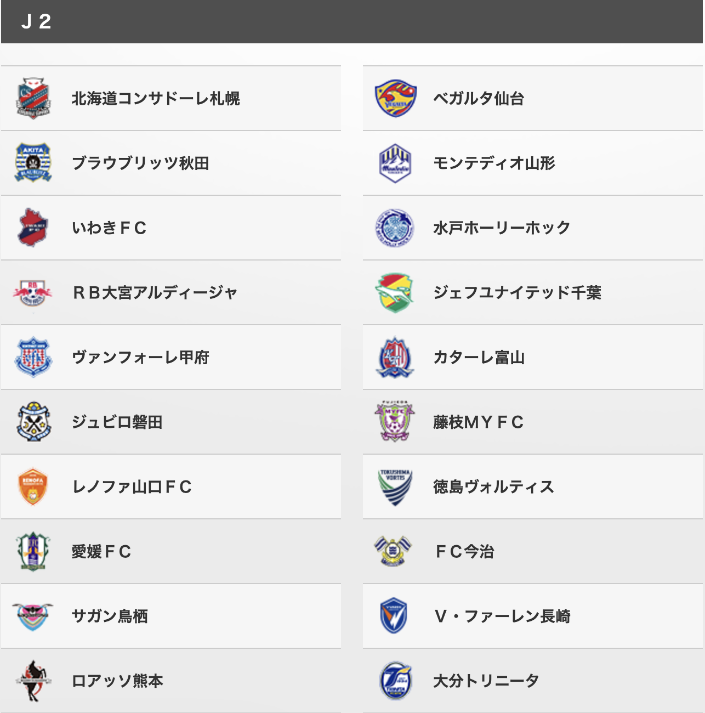
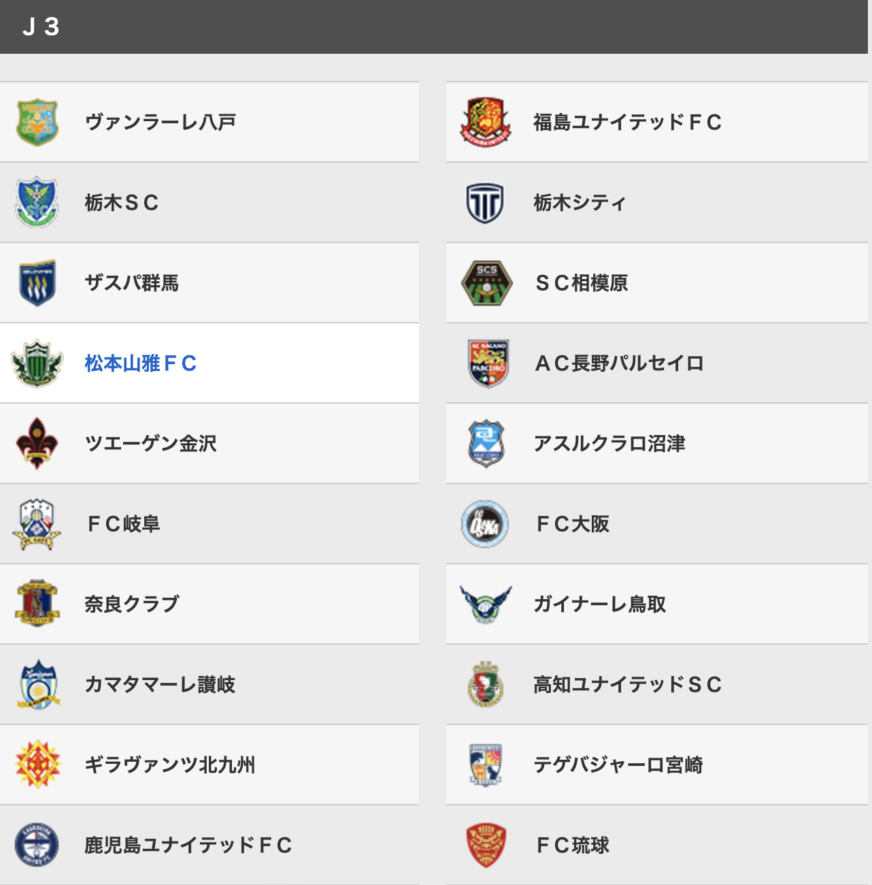
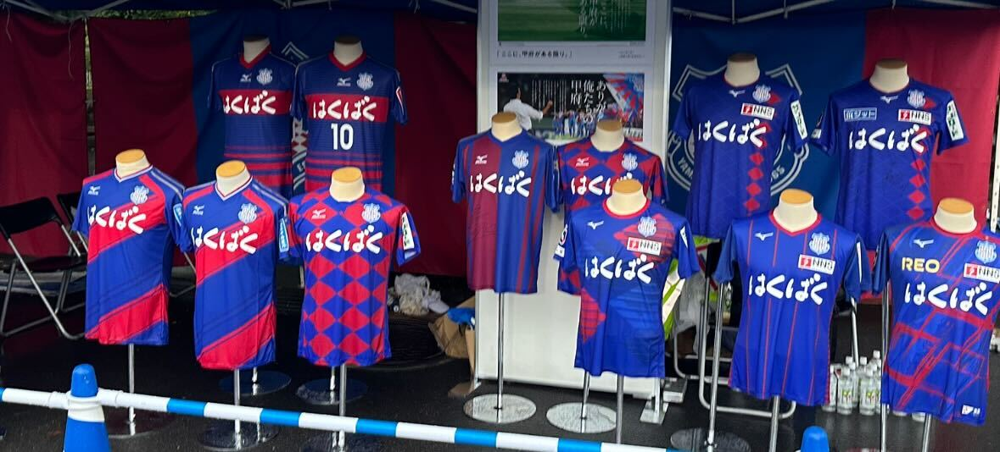

# ヴァンフォーレ甲府

---
layout: intro
---

# 目次

- 第1部「日本サッカーの構造とJリーグ」
- 第2部「ヴァンフォーレ甲府の概要」
- 第3部「歴史 - 栄光と苦難」
- 第4部「応援する楽しさと苦しさ」

---
layout: section
---

# 第1部
## 日本サッカーの構造とJリーグ

---

# 日本サッカーのピラミット構造

  

    J1リーグ（20クラブ）
  

  

    J2リーグ（20クラブ）
  

  

    J3リーグ（20クラブ）
  

  

    JFL（日本フットボールリーグ）
  

  

    地域リーグ（9地域）
  

  

    都道府県リーグ
  

<!--
日本のサッカーはピラミッド構造になっています。
頂点のJ1から都道府県リーグまで、選手たちは昇格を目指して戦います。
-->

---

# 昇格・降格システム

  

    <h3 class="text-xl font-bold mb-4">J1 ⇔ J2</h3>
    

      

        
降格

        
下位3クラブが自動降格

      

      

        
昇格

        
上位2クラブが自動昇格

        
3-6位はプレーオフ

      

    

  

  

    <h3 class="text-xl font-bold mb-4">J2 ⇔ J3</h3>
    

      

        
降格

        
下位3クラブが自動降格

      

      

        
昇格

        
上位2クラブが自動昇格

        
3-6位はプレーオフ

      

    

  

  

    <h3 class="text-xl font-bold mb-4">J3 ⇔ JFL</h3>
    

      

        
降格

        
最下位クラブが自動降格

      

      

        
昇格

        
上位1クラブが自動昇格

        
JFL2位はJ3の19位と入れ替え戦

      

    

  

<!--
昇格・降格があることで、シーズン終盤まで緊張感のある試合が続きます。
これがJリーグの醍醐味の一つです。

どんなチームでもJ1への扉が開かれている一方で裏を返せば下への扉も開かれている
-->

---

# Jリーグの理念

  <h3 class="text-2xl font-bold text-blue-800 mb-2">地域密着</h3>
  <ul class="space-y-2">
    <li>クラブ名に必ず地域名を含める</li>
    <li>ホームタウン制度</li>
    <li>地域貢献活動の義務化</li>
  </ul>

  <h3 class="text-2xl font-bold text-green-800 mb-2">百年構想</h3>
  
「地域に根ざした総合型スポーツクラブ」を目指す

  
サッカーだけでなく、様々なスポーツで地域を豊かに

  
クラブは地域の財産

<!--
Jリーグの最大の特徴は「地域密着」です。
ヨーロッパのクラブのように、100年後も地域に愛されるクラブを目指しています。

企業名を入れない
-->

---

# Jリーグは全部で60クラブ

  
  
  

J1は大都市ばかり...

---

# リーグ戦+カップ戦

リーグ戦の他にカップ戦も毎年開催される

  
  

    <h3 class="text-xl font-bold text-yellow-800 mb-3">🏆 天皇杯</h3>
    <ul class="space-y-2 text-sm">
      <li>全国のチームが参加可能</li>
      <li>J1からアマチュアまで</li>
      <li>1回戦負けで終了のトーナメント</li>
      <li>優勝すればACL出場権獲得</li>
    </ul>
  

  

    <h3 class="text-xl font-bold text-blue-800 mb-3">🏆 ルヴァンカップ</h3>
    <ul class="space-y-2 text-sm">
      <li>J1~J3の全クラブが参加</li>
      <li>グループステージ→ノックアウト</li>
      <li>平日開催が多い</li>
      <li>リーグ戦とは別の栄誉</li>
    </ul>
  

  
カップ戦では「番狂わせ」が起きやすい

  
格下チームが格上を倒すジャイアントキリングの舞台

<!--
リーグ戦以外にも2つの重要なカップ戦があります。
特に天皇杯は全国のチームが参加でき、大きな番狂わせが起こることも。
-->

---
layout: section
---

# 第2部
## ヴァンフォーレ甲府の概要

<!--
それでは、山梨県のクラブ「ヴァンフォーレ甲府」について見ていきましょう。
-->

---
layout: two-cols
---

# ヴァンフォーレ甲府とは

**創設**: 1965年

**ホームタウン**: 山梨県全県

**ホームスタジアム**: JITリサイクルインクスタジアム（小瀬）

**所属リーグ**: J2リーグ

**チームカラー**: 青・赤

  

    <h4 class="font-bold mb-2">ヴァンフォーレの由来</h4>
    
VENT（風）+ FORET（林）というフランス語をベースにした造語

    
武田信玄の「風林火山」から

  

::right::

  
  

<!-- 「風林火山」は、戦国時代の武将、武田信玄の旗印に書かれた言葉で、孫子の兵法に由来する「疾きこと風の如く、徐かなる事林の如く、侵掠すること火の如く、動かざる事山の如し」の略 -->

---

# ヴァンフォーレ甲府の立ち位置

  
  

    <h3 class="text-xl font-bold text-purple-800 mb-3">地方クラブの象徴</h3>
    <ul class="list-disc list-inside space-y-2 text-sm">
      <li>特定の母体企業を持たない</li>
      <li>地域の小口スポンサーで運営</li>
      <li>県民・サポーターが支える</li>
    </ul>
  

  

    <h3 class="text-xl font-bold text-orange-800 mb-3">J2の中堅クラブ</h3>
    <ul class="list-disc list-inside space-y-2 text-sm">
      <li>J1とJ2を行き来</li>
      <li>華やかさより堅実さ</li>
      <li>育成に定評</li>
    </ul>
  

<!--
ヴァンフォーレ甲府は、Jリーグの理念を体現する地方クラブです。
華やかなビッグクラブとは違う、日本サッカーのリアルな姿があります。
-->

---
layout: section
---

# 第3部
## 歴史 - 栄光と苦難

<!--
ヴァンフォーレ甲府の60年の歴史を振り返ります。
-->

---

# 歴史年表

今年はクラブ創設60周年の節目の年

  

    

      
1965

      

        
甲府クラブ

        
創設

      

    

    

      
1999

      

        
J2リーグ

        
参入

      

    

    

      
2000

      

        
経営危機

        
存続の危機

      

    

    

      
2005

      

        
J1初昇格

        
悲願達成

      

    

    

      
2022

      

        
天皇杯優勝

        
クラブ史上初

      

    

    

      
2023

      

        
ACL出場

        
初の国際大会

      

    

  

  
波乱万丈の60年

<!--
創設から60年、山あり谷ありの歴史です。
特に2000年の経営危機と2022年の天皇杯優勝は対照的な出来事でした。
-->

---

# 2000年 最大の危機

  <h3 class="text-2xl font-bold text-red-800 mb-4">クラブ消滅の危機</h3>
  

    

      <h4 class="font-bold mb-2">危機的状況</h4>
      <ul class="space-y-2">
        <li>累積赤字: 4.5億円</li>
        <li>債務超過: 1.2億円</li>
        <li>スポンサー離れ</li>
      </ul>
    

    

      <h4 class="font-bold mb-2">救済の動き</h4>
      <ul class="space-y-2">
        <li>県民募金活動</li>
        <li>地元企業の支援</li>
        <li>サポーターの結束</li>
      </ul>
    

  

  
「県民みんなのクラブ」として再出発

  
この経験が、より強い地域密着型クラブへの転換点に

---
layout: image
image: https://www.yafo.or.jp/wp/wp-content/uploads/2000/06/264-2-12.png
---

<!--
川渕さん
-->

---
layout: image-right
image: https://sports-pctr.c.yimg.jp/dk/iwiz-sports/text/images/2022/1019/2022101700001-spnavi_1_1666154787_view.jpeg
---

# 2022年 天皇杯優勝

## 歴史的快挙

- **J2所属チームが日本一に輝く!!**
- J1の5チームを撃破
- 決勝: ヴァンフォーレ 2-1 広島
- 山梨の街が歓喜に包まれた

  
この優勝が証明したこと

  
地方の小さなクラブでも、夢は叶う

<!--
22年ぶりのタイトル獲得。
J2のクラブがJ1の強豪を次々と倒しての優勝は、
日本サッカー界に大きな衝撃を与えました。
-->
---
layout: image-right
image: ./assets/acl-thai.png
---

# 2023年 ACL出場

ACL = AFC Champions League 
AFC = Asian Football Confederation

- 天皇杯優勝チームとしてアジアの舞台へ
- アジアでベスト16の快挙
- 2部クラブとしては史上初
- 🇦🇺 🇨🇳 🇹🇭 🇰🇷 のチームと対戦

<!--
全部いった（笑）
-->

---
layout: section
---

# 第4部
## 応援する楽しさと苦しさ

<!--
最後に、地方クラブを応援することの醍醐味についてお話しします。
-->

---

# 応援の楽しさ

  
  

    <h3 class="text-xl font-bold text-blue-800 mb-3">🎉 勝利の喜び</h3>
    <ul class="list-disc list-inside space-y-2 text-sm">
      <li>チームの勝利</li>
      <li>番狂わせの興奮</li>
      <li>劇的なゴール</li>
      <li>みんなで喜ぶ一体感</li>
    </ul>
  

  

    <h3 class="text-xl font-bold text-green-800 mb-3">👨‍💼 選手の活躍</h3>
    <ul class="list-disc list-inside space-y-2 text-sm">
      <li>選手の成長を見守る喜び</li>
      <li>謎のブラジル人の活躍 🇧🇷</li>
      <li>無名選手の覚醒</li>
      <li>「発見」する楽しさ</li>
    </ul>
  

  

    <h3 class="text-xl font-bold text-yellow-800 mb-3">✈️ 遠征の楽しみ</h3>
    <ul class="list-disc list-inside space-y-2 text-sm">
      <li>アウェイ遠征で旅行ができる</li>
      <li>日本各地を巡る</li>
      <li>なんなら海外も行ける</li>
      <li>現地グルメも楽しめる</li>
    </ul>
  

<!--
浦和がクラブW杯でアメリカに行っていた
-->

---

# 応援の苦しさ

  
  

    <h3 class="text-xl font-bold text-red-700 mb-3">💸 金銭的な苦しさ</h3>
    <ul class="list-disc list-inside space-y-2 text-sm">
      <li>お金をかけて九州に行っても負ける（笑）</li>
      <li>遠征費・宿泊費がかさむ</li>
      <li>ユニフォーム・グッズ代</li>
      <li>年間シート代</li>
    </ul>
  

  

    <h3 class="text-xl font-bold text-gray-700 mb-3">😤 精神的な苦しさ</h3>
    <ul class="list-disc list-inside space-y-2 text-sm">
      <li>勝敗が仕事のパフォーマンスに影響</li>
      <li>よそのクラブへの嫉妬</li>
      <li>「なんでうちだけ...」</li>
    </ul>
  

  
それでも応援をやめられない

  
喜怒哀楽を毎週のように感じられるのはある幸せではある

<!--
正直、苦しいことの方が多いかもしれません。
でも、だからこそ応援のしがいがあるんです。
-->

---
layout: section
---

# まとめ

---

- Jリーグファンは酔狂
- 趣味・生き甲斐・推し活・宗教のようなもの
- 興味を持っていただけたらぜひスタジアムへ！🏟️
- もしくは「はくばく」の製品のお買い上げを！

※はくばく: ヴァンフォーレ甲府の名誉スポンサー

  
  
  
  

---

# 参考

- [ヴァンフォーレ甲府ホームページ](https://www.ventforet.jp/index)

- [Jリーグチケットの買い方](https://www.jleague.jp/special/beginner/ticket.html)

- [はくばく](https://www.hakubaku.co.jp/)

